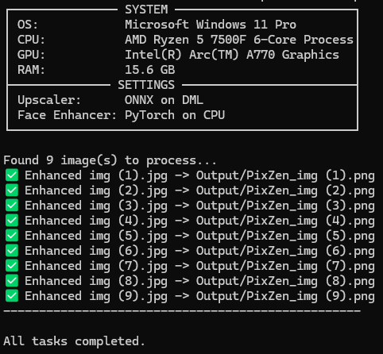

# 🌟 PixZen Command-Line Enhancer



## 🗂 Table of Contents
- 📖 [Introduction](#-introduction)
- ✨ [Features](#-features)
- 🛠️ [Installation](#️-installation)
- 💻 [Usage](#-usage)
- 🤝 [Contributing](#-contributing)
- 📜 [License](#-license)

---

## 📖 Introduction
PixZen is a powerful, cross-platform command-line tool designed to enhance and restore images and videos using state-of-the-art AI models. It specializes in high-quality upscaling and intelligent face restoration.

PixZen's main advantage is its **universal hardware support** and ease of use. It automatically detects and utilizes the best available hardware—be it NVIDIA (CUDA), AMD/Intel (DirectML), or Apple Silicon (CoreML)—to deliver the best possible performance without any manual configuration.

---

## ✨ Features
- 🚀 **Universal GPU Acceleration:** Automatically uses the best backend for your hardware:
    - **NVIDIA:** PyTorch backend with CUDA for maximum performance.
    - **AMD & Intel:** ONNX backend with DirectML for native Windows acceleration.
    - **Apple Silicon:** ONNX backend with CoreML for M-series Macs.
    - **CPU Fallback:** A robust ONNX-based CPU mode ensures it runs anywhere.
- 🖥️ **Polished CLI:** A clean, beautiful interface with a detailed system status panel and active progress indicators.
- 🔀 **Simplified Commands:** Intuitive and memorable command-line arguments for a smooth workflow.
- ✨ **Advanced Face Restoration:** Fixes old photos and low-quality faces with a simple command flag.
- 🖼️ **High-Quality Upscaling:** Utilizes various specialized models for photo, anime, and video enhancement.
- 🎞️ **Seamless Video Enhancement:** Processes videos efficiently frame-by-frame using a powerful internal pipeline, preserving audio tracks.
- 🗂️ **Batch Processing:** Enhance entire folders of images or videos with a single command.
- 🧠 **Smart Model Management:** Models are automatically downloaded on first use and stored in a central cache directory, keeping your project folder clean.
- ⚙️ **Format Control:** Choose your output format (`png`, `jpg`) or let the app automatically match the input format.

---

## 🛠️ Installation
### 📋 Prerequisites
- 🐉 [Anaconda](https://www.anaconda.com/download) or [Miniconda](https://docs.conda.io/projects/conda/en/stable/user-guide/install/index.html)
- 🐍 [Python](https://www.python.org/) 3.12 (recommended)
- ➕ [Git](https://git-scm.com/)
- **Optional GPU Drivers:**
    - **NVIDIA:** Latest drivers and [CUDA Toolkit](https://developer.nvidia.com/cuda-downloads).
    - **AMD/Intel on Windows:** Latest graphics drivers.

### 💾 Steps
1. **Clone the Repository**
   ```bash
   git clone https://github.com/Md-Siam-Mia-Code/PixZen-New.git
   cd PixZen-New
   ```

2. **Create and Activate a Conda Environment**
   ```bash
   # Create the environment with Python 3.12
   conda create -n PixZen python=3.12 -y

   # Activate the new environment
   conda activate PixZen
   ```

3. **Install Core Dependencies**
   ```bash
   pip install -r requirements.txt
   ```

4. **Install the Correct ONNX Runtime**

   This is a **critical step** for hardware acceleration. Please choose **ONE** of the following commands based on your system:
   ```bash
   # For NVIDIA GPUs (CUDA)
   pip install onnxruntime-gpu

   # For AMD and Intel GPUs on Windows (DirectML)
   pip install onnxruntime-directml

   # For CPU-only, or macOS with Apple Silicon (CoreML is included)
   pip install onnxruntime
   ```

5. **Install PixZen in Editable Mode**
   This command links the `PixZen` command to your project folder.
   ```bash
   pip install -e .
   ```

6. **Download Models**
   🚀 The models will be automatically downloaded and configured when you run the application for the first time.

---

## 💻 Usage
### ▶️ Running the Application

PixZen is run directly from your terminal. Here are some common examples:
**Run:**
```
pixzen
```

**1. Basic Enhancement (using defaults)**
This command processes everything in `data/Input` using the default `v2` model.
```bash
PixZen
```

**2. Enhance a Specific Image with 4x Scaling**
```bash
PixZen -i path/to/my_photo.jpg -o path/to/output -s 4
```

**3. Restore an Old Photo with Faces**
This uses the `v2` upscaler and enables `v2` face restoration.
```bash
PixZen -i path/to/old_photo.png -g v2
```

**4. Enhance an Anime Video**
This uses the specialized `AnimeVideo` model for best results on animation.
```bash
PixZen -i my_clip.mp4 -r AnimeVideo
```

**5. Convert an Image to JPG**
This enhances the image and saves the output as a `.jpg` file.
```bash
PixZen -i picture.png -e jpg
```

### 🔠 Command-Line Arguments
| Flag | Long Flag | Description | Default | Options |
| :--- | :--- | :--- | :--- | :--- |
| `-i` | `--input` | Input image, video, or folder. | `data/Input` | Path |
| `-o`| `--output` | Output folder. | `data/Output` | Path |
| `-r` | `--realesrgan` | Upscaler model version. | `v2` | `v1`, `v2`, `Anime`, `AnimeVideo`|
| `-s`| `--outscale`| Final upsampling scale. | `2` | Number (e.g., 2, 4) |
| `-p`| `--prefix` | Prefix for the output filename. | `PixZen` | Text |
| `-t`| `--tile` | Tile size to reduce VRAM usage. | `400` | Number (0=off) |
| `-g`| `--gfpgan` | Enable face enhancement. | `None` | `v1`, `v2` |
| `-e`| `--ext`| Output image extension. | `png` | `auto`, `jpg`, `png` |
| `-h` | `--help` | Show the help message. | | |

---

## 🤝 Contributing
🎉 **Contributions are welcome!** 
- 🌟 Fork the repository.
- 📂 Create a new branch (`git checkout -b feature/YourFeature`).
- 📝 Commit your changes (`git commit -m 'Add some feature'`).
- 📤 Push to the branch (`git push origin feature/YourFeature`).
- 🔃 Open a Pull Request.

---

## 📜 License
- This project is licensed under the MIT License. See the `LICENSE.md` file for details.

---

# ❤️ *Happy Enhancing!* 💯